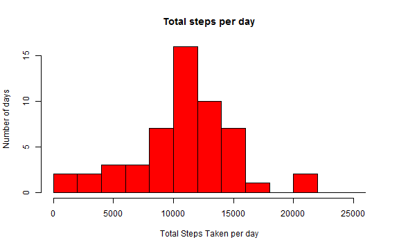
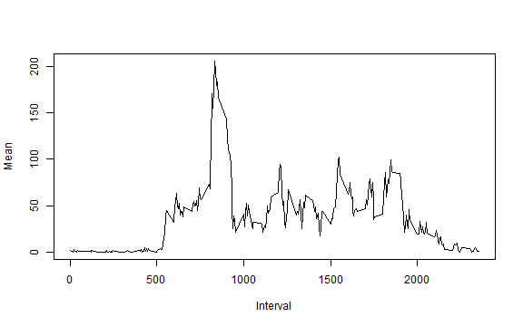
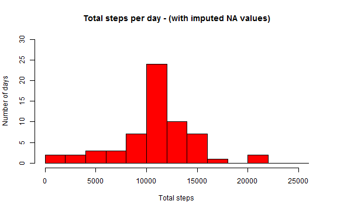
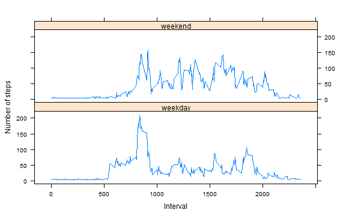

## Set global environment variables

```r
library(knitr)
opts_knit$set(base.dir=normalizePath(getwd()))
opts_knit$set(root.dir=normalizePath(getwd()))
opts_chunk$set(fig.path="figures/")
dir.create("figures",showWarnings=FALSE)
```
## Load and preprocess the data
Create a data frame for analysis. Transform the input date value to a standard date format. Determine the day type for the day of week (e.g. weekend, weekday) by creating a new variable in the data frame.

```r
activity <- read.csv("./activity.csv")
activityDF <- data.frame(date=as.POSIXct(activity$date, format="%Y-%m-%d"),
                         weekday=tolower(weekdays(as.POSIXct(activity$date,format="%Y-%m-%d"))),
                         daytype=ifelse(tolower(weekdays(as.POSIXct(activity$date,format="%Y-%m-%d")))=="saturday" | 
                                        tolower(weekdays(as.POSIXct(activity$date,format="%Y-%m-%d")))=="sunday","weekend","weekday"),
                         steps=activity$steps,
                         interval=activity$interval)
```
## Mean total number of steps taken per day
Determine the number of steps per day. Create a histogram for number of steps per day.  Calculate the mean and median values for steps.

```r
meanSteps <- aggregate(steps ~ date, activityDF, FUN = sum, na.rm = TRUE)
hist(meanSteps$steps,breaks=seq(from=0,to=26000,by=2000),col="red",xlab="Total Steps Taken per day",ylab="Number of days",main="Total steps per day")
```

 

```r
mean(meanSteps$steps)
```

```
## [1] 10766.19
```

```r
median(meanSteps$steps)
```

```
## [1] 10765
```
## Average daily activity pattern
Determine the number of steps per daily interval. Plot the daily activity. Determine the interval which contains the maximum number of steps based on the average daily activity. 

```r
stepsInterval <- aggregate(activity$steps,by=list(activity$interval),FUN=mean,na.rm=TRUE)
names(stepsInterval) <- c("Interval", "Mean")
plot(stepsInterval, type = "l")
```

 

```r
maxPosition <- which(stepsInterval$Mean == max(stepsInterval$Mean))
stepsInterval[maxPosition, 1]
```

```
## [1] 835
```

## Impute missing values
Determine the total number of missing values in the activities dataset. Create a new dataset by imputing missing values. Plot the total number of steps taken each day. Calculate the mean and median total number of steps taken per day including the imputed data.

```r
sum(is.na(activityDF))
```

```
## [1] 2304
```

```r
naValues <- which(is.na(activityDF$steps))
meanValues <- rep(mean(activityDF$steps, na.rm=TRUE), times=length(naValues))
imputedActivityDF<-activityDF
imputedActivityDF[naValues, "steps"] <- meanValues
stepsImputedInterval <- aggregate(imputedActivityDF$steps,by=list(imputedActivityDF$date),FUN=sum)
names(stepsImputedInterval) <- c("Date", "Total")
hist(stepsImputedInterval$Total,breaks=seq(from=0,to=26000,by=2000),col="red",xlab="Total steps"
     ,ylab="Number of days",ylim=c(0,30),main="Total steps per day - (with imputed NA values)")
```

 

```r
mean(stepsImputedInterval$Total)
```

```
## [1] 10766.19
```

```r
median(stepsImputedInterval$Total)
```

```
## [1] 10766.19
```

## Difference in activity patterns between weekdays and weekends
Determine the mean number of steps taken by daytype. Plot the time series of the 5-minute interval and average number of steps averaged across all weekday days or weekend days.

```r
library(lattice)
stepsDaytypeInterval <- aggregate(imputedActivityDF$steps,by=list(imputedActivityDF$daytype,imputedActivityDF$interval), FUN=mean)
names(stepsDaytypeInterval) <- c("Daytype","Interval","Mean")
xyplot(Mean ~ Interval | Daytype,stepsDaytypeInterval,type="l",lwd=1,xlab="Interval",ylab="Number of steps",layout=c(1,2))
```

 
